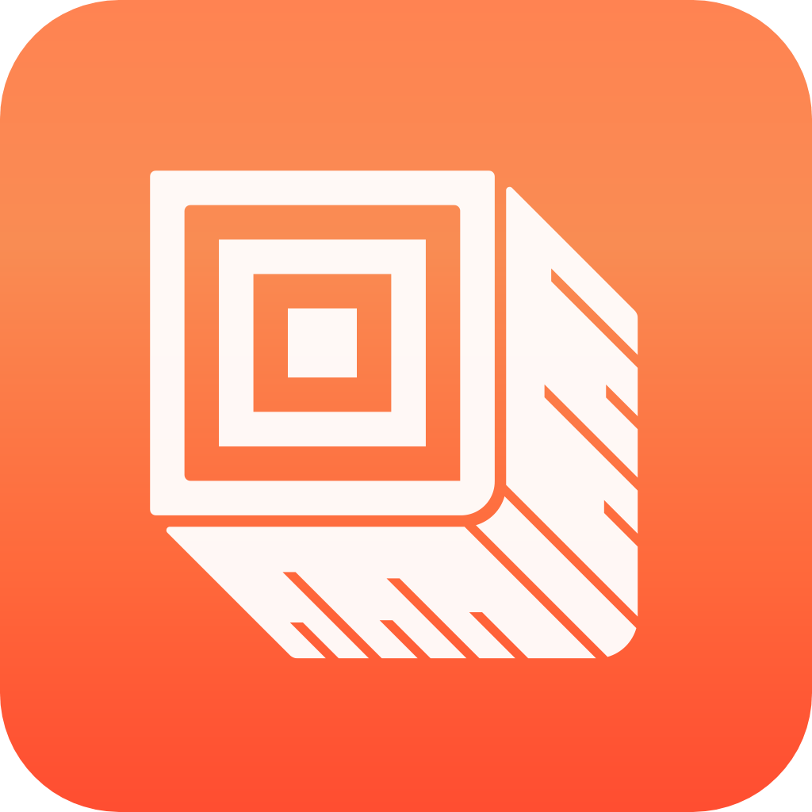

<p align="center">
  
</p>

<h1 align="center">LogHome 原木社区</h1>

<p align="center">
  
  
  
  
  
</p>

## 📖 项目介绍

LogHome (原木社区)是一个集成了多端技术栈的完整小说读写社区项目，包含移动端、Web端和后端服务等多个模块。

## 🗂️ 项目结构

```text
loghome
├── loghome-app-frontend    # 移动端前端项目 (uni-app)
├── loghome-backend        # 后端服务（express.js）
└── loghome-flutter       # Flutter原生混合开发套件
```

此为原木社区完整技术代码仓库，其中包含了原木社区的前端、后端、Flutter混合开发套件和PC端运行环境。

进入到对应的文件夹下，查看对应项目的README.md可以获取更详细的运行指南。

## ✨ 主要功能

- 📱 移动端跨平台支持 (iOS/Android)
- 💻 PC端完整功能支持
- 🔄 Flutter混合开发能力
- 🌐 统一的后端服务支持

## 🚀 快速开始

请参考各子项目目录下的 README.md 获取详细的开发和部署指南：

- [移动端开发指南](loghome-app-frontend/README.md)
- [后端服务开发指南](loghome-backend/README.md)
- [Flutter开发指南](loghome-flutter/README.md)

## 🛠️ 技术栈

- 前端: uni-app, Vue.js, Flutter
- 后端: Node.js
- 数据库: MySQL
- 混合开发: Flutter

## 📄 许可证

本项目采用 GPL 许可证，详见 [LICENSE](LICENSE) 文件。

## 🤝 贡献指南

欢迎提交 Issue 或 Pull Request 来帮助改进项目。

## 📞 联系我们

- 项目主页：[https://openloghome.github.io/homepage/](https://openloghome.github.io/homepage/)
- 原木社区网页端：[https://loghome.codesocean.top](https://loghome.codesocean.top)
